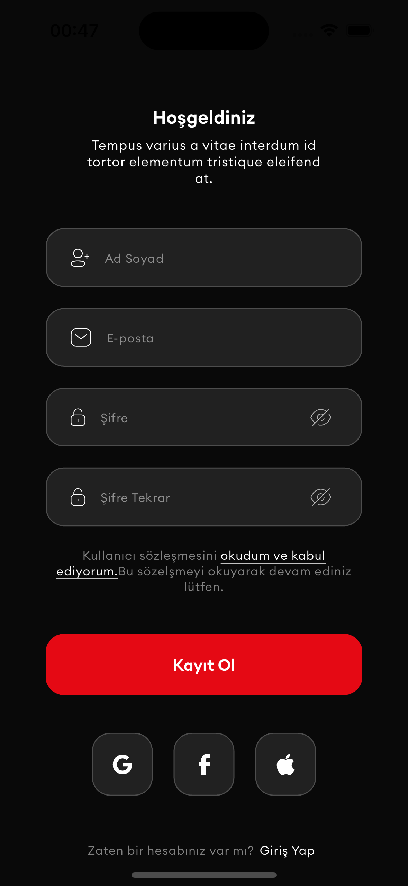
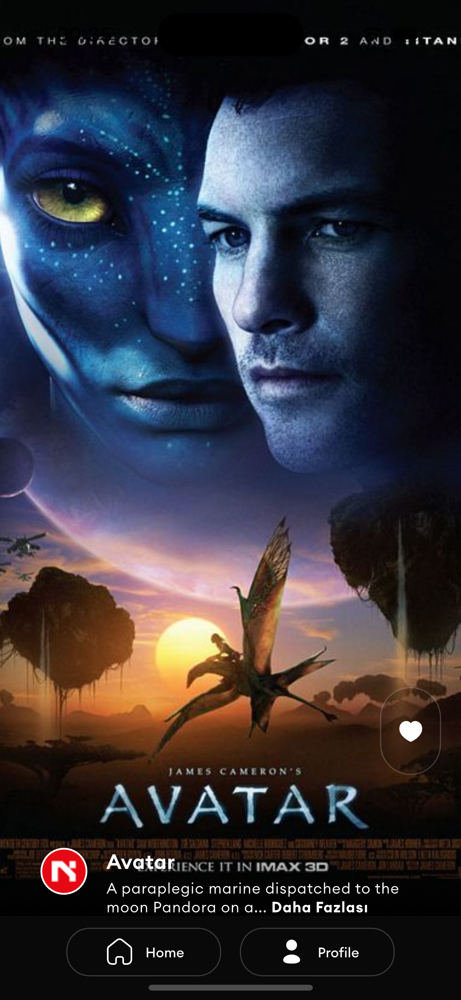
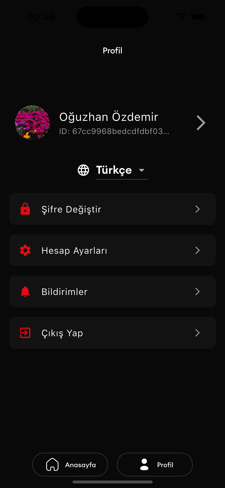

# Flutter Developer Test Case

## 📌 Proje Genel Bakışı / Project Overview
Bu Flutter projesi, Flutter Developer pozisyonu için yapılan teknik değerlendirme kapsamında geliştirilmiştir. Uygulama, kimlik doğrulama, sonsuz kaydırmalı bir ana sayfa, profil bölümü ve akıcı bir navigasyon sistemini içermektedir. Çoğu özellik gerekliliklerin ötesinde uygulanmış olup, yalnızca Firebase entegrasyonu bonus özelliklerden hariç tutulmuştur.

This Flutter project was developed as part of a technical assessment for a Flutter Developer position. The application includes authentication, an infinite scrolling home page, a profile section, and smooth navigation. Most features were implemented beyond the requirements, with only Firebase integration omitted from the bonus section.

---

## 📱 Uygulanan Özellikler / Features Implemented

### 🔑 Kimlik Doğrulama (Giriş & Kayıt) / Authentication (Login & Register)
- Kullanıcı giriş ve kayıt işlemleri. / User login and registration functionality.
- Oturum token'ının güvenli şekilde saklanması. / Secure storage of session tokens.
- Başarılı girişte otomatik olarak ana sayfaya yönlendirme. / Automatic redirection to the home page upon successful login.

| Giriş Ekranı / Login Screen | Kayıt Ekranı / Register Screen |
|----------------|----------------|
|  |  |

### 🏠 Ana Sayfa (Keşfet) / Home Page (Discover)
- Sonsuz kaydırma özelliği (Her seferinde 5 film yükleme). / Infinite scroll implementation (lazy loading movies 5 at a time).
- Otomatik yükleme göstergesi. / Automatic loading indicator.
- Aşağı çekerek yenileme (Pull-to-refresh) özelliği. / Pull-to-refresh functionality.
- Favori filmler eklenirken anlık UI güncellemesi. / Real-time UI updates when favoriting/unfavoriting movies.

| Ana Sayfa / Home Page | Sonsuz Kaydırma / Infinite Scroll |
|----------------|----------------|
|  |  |

### 👤 Profil Sayfası / Profile Page
- Kullanıcı bilgilerini gösterme. / Displays user information.
- Favori filmler listesi. / Shows a list of favorite movies.
- Profil fotoğrafı yükleme ve değiştirme. / Allows users to upload and change their profile picture.

| Profil Sayfası / Profile Page | Favori Filmler / Favorite Movies |
|----------------|----------------|
|  |  |

### 🎁 Sınırlı Teklif Bottom Sheet / Limited Offer Bottom Sheet
- Özel tasarım bottom sheet uygulaması. / Custom bottom sheet implementation for limited-time offers.

| Bottom Sheet |
|----------------|
|  |

---

## 🎯 Bonus Özellikler / Bonus Features
✅ **State Management**: Riverpod ile etkin durum yönetimi. / Riverpod used for efficient state handling.
✅ **Animasyonlar**: Lottie ile akıcı UI geçişleri. / Smooth UI transitions with Lottie.
✅ **Güvenli Token Yönetimi**: Oturum token'ları güvenli bir şekilde saklanıyor. / Session tokens stored securely.
✅ **Splash Screen & Uygulama İkonu**: Marka uyumlu açılış ekranı ve özel uygulama ikonu. / Added branded splash screen & custom app icon.
✅ **Logger Uygulaması**: Yapısal loglama ve hata ayıklama. / Logs structured for debugging & error handling.
✅ **Çoklu Dil Desteği**: Birden fazla dil için lokalizasyon. / Localization for multiple languages.

❌ **Firebase Entegrasyonları (Crashlytics & Analytics) Uygulanmadı** / **Firebase Integrations (Crashlytics & Analytics) Not Implemented**

---

## 🚀 Kurulum & Çalıştırma / Installation & Setup
1. **Depoyu Klonlayın / Clone the Repository:**
   ```sh
   git clone https://github.com/ozdemiroguz/flutter_test_case.git
   ```
2. **Proje Klasörüne Girin / Navigate to the Project Folder:**
   ```sh
   cd flutter_test_case
   ```
3. **Bağımlılıkları Yükleyin / Install Dependencies:**
   ```sh
   flutter pub get
   ```
4. **Uygulamayı Çalıştırın / Run the App:**
   ```sh
   flutter run
   ```

---

## 📜 Lisans / License
Bu proje açık kaynaklıdır ve özgürce değiştirilebilir. / This project is open-source and available for modification.

---

## 📧 İletişim / Contact
Herhangi bir sorunuz için [GitHub Issues](https://github.com/ozdemiroguz/flutter_test_case/issues) üzerinden ulaşabilirsiniz. / For any questions, feel free to reach out via [GitHub Issues](https://github.com/ozdemiroguz/flutter_test_case/issues).
